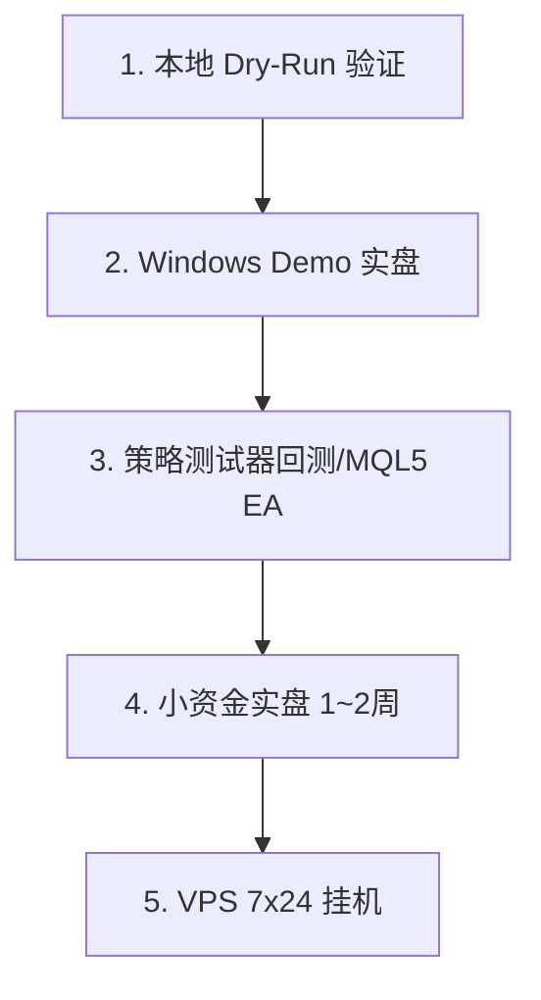

# MT5 接入完整指南 — 把 Backtrader 策略搬到真实交易

> 本项目是 **Backtrader 回测框架**，不能直接在 MT5 上运行。  
> 本指南提供 **3 种实盘方案**，已为你写好全部代码，开箱即用。

---

## 1. 总览：为什么不能直接运行？

| 概念 | 本项目 | MT5 实盘 |
|------|--------|----------|
| **框架** | Backtrader（Python 回测引擎） | MetaTrader 5 终端（C++ / MQL5） |
| **数据** | 本地 CSV `data/XAUUSD_5m_5Yea.csv` | 经纪商实时推送的 M5 K线 |
| **订单** | `cerebro.broker` 模拟撮合 | `OrderSend` 真实下到经纪商服务器 |
| **时间** | 历史快进 | 实时逐根 Bar 推进 |

**结论**：必须把策略逻辑“翻译”成 MT5 能执行的形态。本仓库已提供两种翻译结果，你只需选一条路。

---

## 2. 三条接入路径对比

| 路径 | 适合人群 | 延迟 | 稳定性 | 开发量 | 文件位置 |
|------|----------|------|--------|--------|----------|
| **A. Python 桥接（推荐新手）** | 熟悉 Python，想最快复用现有代码 | 10~50ms | 依赖 MT5 终端保持在线 | ⭐ 已完成，零改动可用 | `src/mt5/run_live.py` |
| **B. MQL5 原生 EA（推荐实盘）** | 追求稳定/低延迟/VPS 挂机 | 1~5ms | 最高，MT5 内核执行 | ⭐ 已完成，编译即用 | `MQL5/SunriseOgle_XAUUSD.mq5` |
| **C. ZeroMQ 分离架构** | 量化团队，需要 Python 与 MT5 解耦 | 20~80ms | 中等 | 需额外开发 | 见第 6 节思路 |

> **新手建议**：先用 **A 路径 Dry-Run** 验证逻辑，再切 **B 路径** 长期挂机。

---

## 3. 路径 A：Python 桥接（最快上手）

### 3.1 原理

```
MT5 终端 (Windows)  <--- MetaTrader5 Python API --->  src/mt5/run_live.py (Python)
        ↑  实时 M5 K线  |  下单/平仓  |
        └── 经纪商服务器
```

Python 每 10 秒轮询一次最新 M5，用 `LiveSunriseStrategy`（与回测 1:1 的纯 Python 状态机）判断信号，通过 `MT5Client` 发单。

### 3.2 环境要求

* **操作系统**：必须 **Windows**（MetaTrader5 官方 pip 包仅支持 Windows）。Mac/Linux 只能用 Dry-Run 模拟或改用路径 B。
* **MT5 终端**：从经纪商官网或 https://www.metatrader5.com 下载安装
* **Python**：3.8+，已安装本项目依赖

### 3.3 安装步骤

#### 第 1 步：安装 MT5 并登录

1. 安装并打开 MT5 → 文件 → 开立模拟账户（先用 Demo 测试！）
2. 记录：**登录号 / 密码 / 服务器**（如 `MetaQuotes-Demo`）
3. 顶部工具栏点击 **Algo Trading** 使其变绿
4. 工具 → 选项 → EA交易 → 勾选 **允许自动交易** 和 **允许导入 DLL**

#### 第 2 步：安装 Python 依赖

```powershell
# 在项目根目录
pip install -r requirements.txt
pip install MetaTrader5 pandas  # Windows 必装；Linux 可跳过 MetaTrader5

# 验证
python -c "import MetaTrader5; print(MetaTrader5.__version__)"
```

`requirements.txt` 已包含 `backtrader / pandas / numpy / matplotlib`，只需额外加 `MetaTrader5`。

#### 第 3 步：Dry-Run 预演（无需 MT5）

在任何系统上（包括 Linux / Mac）先验证逻辑：

```bash
# 1. 离线验证策略与回测一致性
python -m src.mt5.live_strategy --csv data/XAUUSD_5m_5Yea.csv

# 2. 模拟实盘循环（用本地 CSV 假装是实时行情，不发真实订单）
python src/mt5/run_live.py --dry-run --symbol XAUUSD

# 3. 仅跑一次信号判断
python src/mt5/run_live.py --dry-run --once
```

预期输出：

```
Sunrise Ogle MT5 模拟 启动
品种: XAUUSD | 周期: M5 | Magic: 20250918 | 风险: 1.0%
预热完成，当前状态: SCANNING | 最新价: 1955.48
📡 SCANNING -> ARMED_LONG | 触发K线 ...
🚪 窗口已开 LONG ...
🎯 收到入场信号 | BUY LONG | Entry=1952.84 SL=... TP=...
[DRY_RUN] 模拟下单 | BUY XAUUSD Vol=0.12 SL=... TP=... | Ticket=100001
```

若 Dry-Run 正常，说明状态机逻辑与回测一致。

#### 第 4 步：连接真实 MT5（Windows）

```powershell
# 最简（MT5 与 Python 在同一台 Windows，让 API 自动发现终端）
python src/mt5/run_live.py --live --login 12345678 --password "你的密码" --server "MetaQuotes-Demo"

# 指定终端路径（多开 MT5 时必填）
python src/mt5/run_live.py --live --login 12345678 --password "xxx" --server "MetaQuotes-Demo" --path "C:\Program Files\MetaTrader 5\terminal64.exe"

# 自定义风控
python src/mt5/run_live.py --live --login ... --risk 0.01 --symbol XAUUSD --poll 10

# 双向交易（默认仅 LONG，与回测一致；如需同时做空）
python src/mt5/run_live.py --live --login ... --enable-short
```

**关键参数说明：**

| 参数 | 含义 | 默认 |
|------|------|------|
| `--login` | MT5 账号 | 必填 |
| `--password` | 密码 | 必填 |
| `--server` | 服务器名 | 必填 |
| `--path` | terminal64.exe 路径 | 自动发现 |
| `--symbol` | 品种名（不同经纪商可能是 GOLD / XAUUSD.a / XAUUSDc） | XAUUSD |
| `--risk` | 每笔风险百分比 | 0.01 |
| `--poll` | 轮询秒数 | 10 |
| `--max-daily-loss` | 日内熔断百分比 | 0.05 |
| `--magic` | Magic Number，用于区分本策略订单 | 20250918 |

#### 第 5 步：实盘风控清单（必读）

* ✅ **先在 Demo 账户跑 1~2 周**，确认信号与回测一致
* ✅ **单持仓限制**：脚本默认有持仓时拒绝新信号，避免加仓爆仓
* ✅ **必带 SL/TP**：所有订单都带止损止盈，无裸单
* ✅ **日内熔断**：当日亏损达 5% 自动停机并平仓
* ✅ **断线重连**：网络中断后自动尝试 `mt5.initialize`
* ✅ **Ctrl+C 优雅退出**：会询问是否平仓

---

## 4. 路径 B：MQL5 原生 EA（最稳）

### 4.1 原理

```
MT5 终端内置执行  MQL5/SunriseOgle_XAUUSD.mq5  -->  经纪商服务器
   （无需 Python，EA 在 MT5 内核直接运行，延迟最低）
```

适合 **VPS 7x24 挂机**、**追求最低延迟** 的用户。

### 4.2 安装步骤

1. **复制文件**  
   将 `MQL5/SunriseOgle_XAUUSD.mq5` 复制到 MT5 数据目录的 `MQL5/Experts/` 文件夹  
   打开 MT5 → 文件 → 打开数据文件夹 → MQL5 → Experts

2. **编译**  
   按 `F4` 打开 MetaEditor → 左侧找到 `SunriseOgle_XAUUSD.mq5` → 点击 **Compile**（或 F7）  
   底部显示 `0 error(s), 0 warning(s)` 即成功

3. **加载到图表**  
   重启 MT5 → 导航 → EA交易 → 找到 `SunriseOgle_XAUUSD` → 拖到 **XAUUSD M5** 图表  
   弹窗中：
   * 常规 → 勾选 **允许自动交易**
   * 输入参数 → 按需调整（见下表），默认与回测一致
   * 点击确定

4. **确认运行**  
   图表右上角出现 **☺ 笑脸** 即运行正常；出现 **☹ 哭脸** 表示 Algo Trading 未开启

### 4.3 输入参数（与 Python 版本 1:1）

在 EA 属性 → 输入参数 中可调整：

* `InpEMA_Fast/Medium/Slow/Confirm/Filter` — EMA 周期
* `InpATR_Period` — ATR 周期
* `InpEnableLong / InpEnableShort` — 交易方向
* `InpLong_PullbackMax / InpShort_PullbackMax` — 回撤深度
* `InpLong_WindowPeriods / InpShort_WindowPeriods` — 窗口期
* `InpRiskPercent` — 每笔风险（或 `InpFixedLots` 固定手数）
* `InpMagicNumber` — 订单标识
* `InpUseTimeFilter` + `InpStartHour/Minute` — 时间过滤

> 修改后建议先在 **策略测试器**（Ctrl+R）用历史数据回测，确认与 Python 回测收益接近。

### 4.4 策略测试器回测（验证一致性）

MT5 → 视图 → 策略测试器 → 选择 `SunriseOgle_XAUUSD` → 品种 XAUUSD → 周期 M5 → 时间 2020.07.10~2025.07.25 → 开始  
对比 Python 回测的 `Trades: 175 WinRate: 55.43% PF: 1.64`，误差应在 ±5% 内（因不同经纪商点差）。

---

## 5. 关键差异与注意事项

### 5.1 品种命名

不同经纪商 XAUUSD 命名不同：

| 经纪商 | 常见名称 |
|--------|----------|
| 大多数 | `XAUUSD` |
| 部分 | `GOLD` / `XAUUSD.a` / `XAUUSDc` / `GOLD#` |

若 `run_live.py` 报错 `品种不存在`，请在 MT5 市场报价中右键 → 显示全部，查看正确名称后用 `--symbol` 指定。

### 5.2 合约规格

| 项目 | XAUUSD 典型值 |
|------|---------------|
| 1 手 = | 100 盎司 |
| 最小手数 | 0.01 手 |
| 步进 | 0.01 |
| 点值 | 0.01（1 tick = $0.01） |
| 杠杆 | 30:1（5% 保证金）或 20:1 |

`MT5Client.calculate_lot_size()` 会自动读取 `symbol_info`，无需手动改。

### 5.3 点差与滑点

* 回测未计点差，实盘需关注：XAUUSD 点差通常 20~40 points（$0.20~$0.40）
* 脚本默认 `deviation=20`，点差剧烈时可能出现 `retcode 10015 价格无效`，属正常，重试即可
* 建议避开 **非农 / CPI** 等高波动时段

### 5.4 时间与时区

* 策略 `USE_TIME_RANGE_FILTER` 默认关闭（24小时交易）
* 如需启用，`run_live.py` 中 `config.use_time_range_filter = True`，时间按 **UTC** 判断
* MT5 服务器时间通常为 GMT+2/+3，与 UTC 有偏移，注意转换

---

## 6. 路径 C：ZeroMQ 分离架构（进阶）

适合需要 **Python 负责决策、MT5 负责执行** 的团队：

```
Python 策略端 (Linux) --ZeroMQ--> MT5 EA 执行端 (Windows VPS)
     LiveSunriseStrategy              ZMQ Receiver EA
```

**思路：**

1. Python 侧：`pip install pyzmq`，将 `signal` 通过 `zmq.PUB` 推送
2. MT5 侧：编写 `ZMQ_Executor.mq5`，`zmq.SUB` 接收后调用 `trade.Buy/Sell`
3. 好处：Python 可部署在任意系统，MT5 仅作为执行器

本仓库未内置此模式，如需可基于 `src/mt5/live_strategy.py` + `https://github.com/dingmaotu/mql-zmq` 自行扩展。

---

## 7. 常见问题 FAQ

**Q1: `ImportError: No module named 'MetaTrader5'`？**  
A: 该包仅支持 Windows。请在 Windows 上 `pip install MetaTrader5`，或在 Linux/Mac 上使用 `--dry-run`。

**Q2: `MT5 initialize 失败` / `last_error (-6, '...' )`？**  
A: 依次检查：1) MT5 终端是否已登录 2) `--path` 是否指向正确的 terminal64.exe 3) 终端是否以管理员运行 4) 账号密码服务器是否正确。

**Q3: `品种 XAUUSD 不存在`？**  
A: 见 5.1 节，用市场报价中的正确名称，如 `--symbol GOLD`。

**Q4: `TRADE_RETCODE 10027` 自动交易被禁用？**  
A: MT5 工具栏点击 **Algo Trading** 变绿；工具 → 选项 → EA交易 → 勾选 **允许自动交易**。

**Q5: `回测 175 笔，实盘信号很少`？**  
A: 检查：1) 是否为 `LONG ONLY` 模式（默认不开空） 2) 时间过滤是否误启用 3) 实时 ATR 是否在阈值内 4) 用 `--dry-run` 对比本地 CSV 信号数 `python -m src.mt5.live_strategy --csv data/XAUUSD_5m_5Yea.csv` 应接近 170+。

**Q6: 手数计算异常大/小？**  
A: 检查账户杠杆与余额；脚本按 `风险金额 / (SL距离 * 合约大小)` 计算，SL 距离过小会导致手数过大，已做 `volume_min/max` 限制。

**Q7: 可以同时跑 Python 桥接和 MQL5 EA 吗？**  
A: 不建议（会双重下单）。二选一，并用不同 `MagicNumber` 区分。

---

## 8. 推荐上线流程



1. **验证**：`python -m src.mt5.live_strategy --csv data/XAUUSD_5m_5Yea.csv` 确认信号数 ≈175
2. **模拟**：`python src/mt5/run_live.py --dry-run` 跑通状态机
3. **Demo 实盘**：Windows MT5 Demo 账户 `run_live.py --live` 或 MQL5 EA
4. **小资金实盘**：0.01 手起步，观察一周
5. **放大**：确认稳定后按 1% 风险正常运行，建议部署到 Windows VPS

---

## 9. 文件清单

```
src/mt5/
  mt5_client.py      # MT5 连接/行情/下单封装（支持 Dry-Run）
  live_strategy.py   # 与回测 1:1 的纯 Python 状态机（无 Backtrader 依赖）
  run_live.py        # 实盘主循环（轮询/风控/下单）

MQL5/
  SunriseOgle_XAUUSD.mq5  # MT5 原生 EA，编译即用

docs/
  MT5_GUIDE.md       # 本文档
```

---

## 10. 免责声明

* 本软件仅供 **教育与研究**，不构成投资建议
* 实盘交易存在 **本金亏损** 风险，XAUUSD 波动剧烈
* 请先在模拟账户充分测试，风险自负
* 过去回测表现不代表未来收益

---

**需要帮助？** 请提 Issue 或查看 `README.md` 与 `PERFORMANCE_METRICS.md`。
